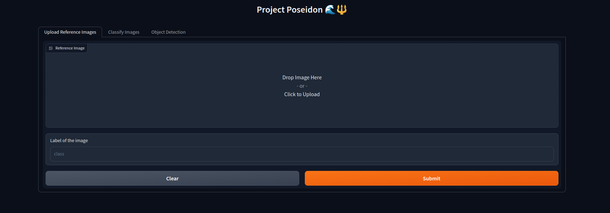
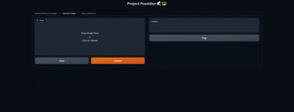
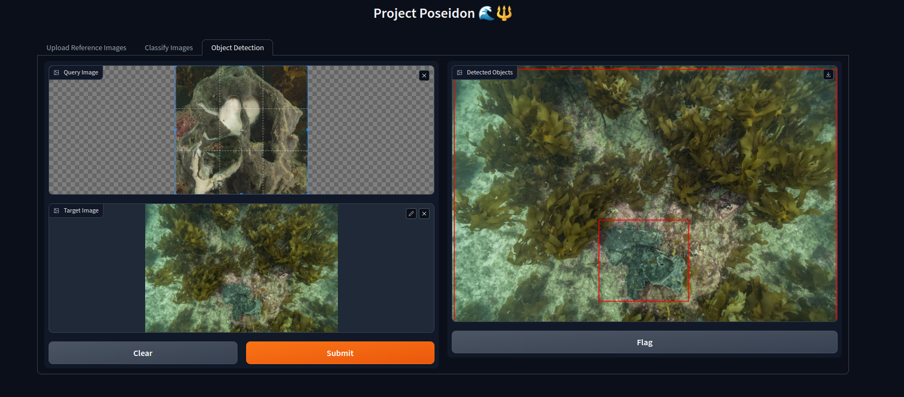

# Project Poseidon 🌊🔱


This project is an offspring of a Hackathon that I had participated in related to **Climate change**.

The objective was to design an algorithm that can monitor and classify the state of sea-sponges in the sea. 

## How to use the App

To use the app first make sure you have `Miniconda` or `Anaconda` installed in your system. 

If that's installed then fire up your terminal and run the below command:

```{bash}
conda env create -f climate_change.yml
```

The above command will create a conda environment in your system and install the necessary packages inside the environment to run the app.

Now after the environment is complete, simply copy-paste the following command in your terminal:

```{bash}
gradio gradio_app.py
```

The above command will launch the gradio app in your `localhost:7860`

## The App



There are 3 sections in this app. 

* Upload Reference images
* Classify images
* Object Detection

To classify images, you need to first upload the images in the `Upload Reference Image` section as follows:


And then head over to the `Classify Images` section to classify image of your need.



You can also perform **Zero-shot Object Detection** with this app, as shown in the below image:



If you like this project give it a star 🌟. In, the meantime suggest improvements or raise errors/PRs so that I can make this project much better than what it is right now.


